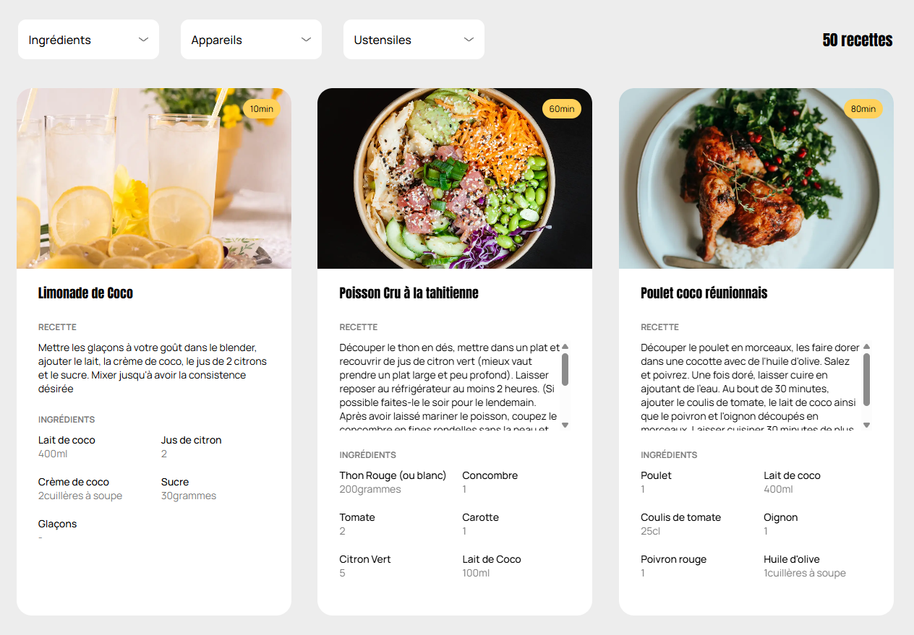
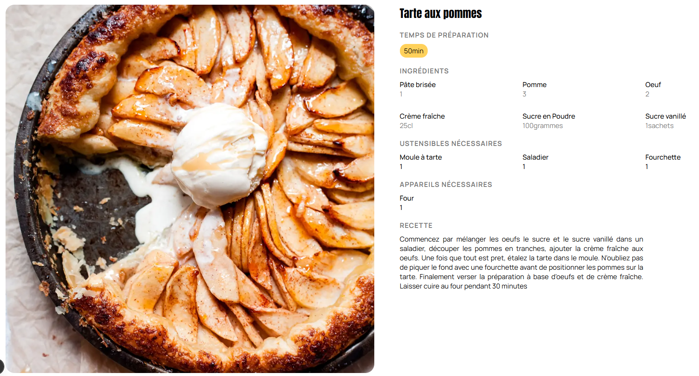

# P5 Les Petits Plats OC

[](#)
[](#)
[](#)


## Preview

### Homepage



### Recipe



---

## 🇫🇷 Version française

Ceci est le dépôt GitHub pour le projet "Les Petits Plats", réalisé dans le cadre de la formation **Développeur IA** d'OpenClassrooms.

L’objectif principal est de développer un site web de recettes de cuisine en utilisant des algorithmes de recherche performants pour offrir une expérience utilisateur fluide et efficace.

L'application est entièrement développée avec **Next.js** et se concentre sur les points suivants :

1.  **Affichage des Recettes :** Présentation claire et structurée des recettes à partir d'un jeu de données local.
2.  **Recherche Performante :** Implémentation de recherche par saisie libre ou par tag pour filtrer les recettes.

### Fonctionnalités Clés

- Affichage des recettes sous forme de cartes interactives.
- Barre de recherche principale pour une recherche globale sur les titres, ingrédients et descriptions.
- Menus de filtres dynamiques pour une recherche par tags.

## Technologies utilisées

| Pile Technique      | Outil               | Rôle                                                                 |
| :------------------ | :------------------ | :------------------------------------------------------------------- |
| **Framework**       | **Next.js**         | Framework React Full-Stack pour le routing et le rendu côté serveur. |
| **Bibliothèque UI** | **React**           | Construction de l'interface utilisateur dynamique.                   |
| **Langage**         | **TypeScript (TS)** | Assure une codebase robuste et fortement typée.                      |
| **Styling**         | **CSS Modules**     | Gestion des styles de manière modulaire et sans conflits.            |
| **Données**         | **JSON**            | Stockage des recettes dans un fichier local.                         |

## Installation & utilisation

1.  **Cloner le dépôt**

    ```bash
    git clone https://github.com/ifTrueReturnFalse/retraining-next-les-petits-plats.git
    cd retraining-next-les-petits-plats
    ```

2.  **Installer les dépendances Node.js**

    ```bash
    npm install # ou yarn install, ou pnpm install
    ```

3.  **Récupérer les images des recettes**

    Les images sont à télécharger via cette adresse :

    ```bash
    https://course.oc-static.com/projects/D%C3%A9veloppeur+Web/JS/P7/JSON+recipes.zip
    ```

    Les 50 fichiers sont à mettre dans ce dossier :

    > public/images/recipes/

4.  **Lancer le serveur de développement**

    ```bash
    npm run dev
    ```

    L'application sera accessible sur `http://localhost:3000` (par défaut).

---

## 🇬🇧 English version

This is the GitHub repository for the "Les Petits Plats" project, created as part of the **Application Developer - JavaScript React** training program at OpenClassrooms.

The main objective is to develop a recipe website using efficient search algorithms to provide a smooth and effective user experience.

The application is fully developed in **Full-Stack JavaScript/TypeScript** with **Next.js** and focuses on the following key aspects:

1.  **Recipe Display:** Clear and structured presentation of recipes from a local dataset.
2.  **Efficient Search:** Implementation of free-text or tag-based search for filtering recipes.

### Key Features

- Display of recipes as interactive cards.
- Main search bar for a global search on titles, ingredients, and descriptions.
- Dynamic filter menus for tag-based searching.

## Technologies Used

| Tech Stack     | Tool                | Role                                                              |
| :------------- | :------------------ | :---------------------------------------------------------------- |
| **Framework**  | **Next.js**         | Full-Stack React Framework for routing and server-side rendering. |
| **UI Library** | **React**           | Building the dynamic user interface.                              |
| **Language**   | **TypeScript (TS)** | Ensures a robust and strongly-typed codebase.                     |
| **Styling**    | **CSS Modules**     | Manages styles in a modular and conflict-free way.                |
| **Data**       | **JSON**            | Stores recipes in a local file.                                   |

## Installation & Usage

1.  **Clone the repository**

    ```bash
    git clone https://github.com/ifTrueReturnFalse/retraining-next-les-petits-plats.git
    cd retraining-next-les-petits-plats
    ```

2.  **Install Node.js dependencies**

    ```bash
    npm install # or yarn install, or pnpm install
    ```

3.  **Get the recipes images**

    The images can be found with this link :

    ```bash
    https://course.oc-static.com/projects/D%C3%A9veloppeur+Web/JS/P7/JSON+recipes.zip
    ```

    The 50 images files must be placed in this folder :

    > public/images/recipes/

4.  **Run the development server**

    ```bash
    npm run dev
    ```

    The application will be accessible at `http://localhost:3000` (by default).
